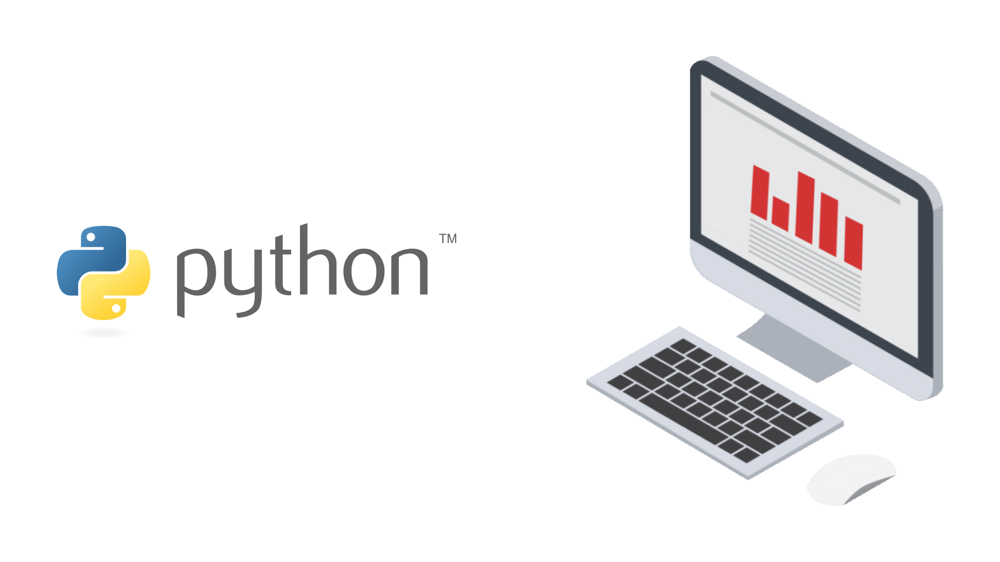
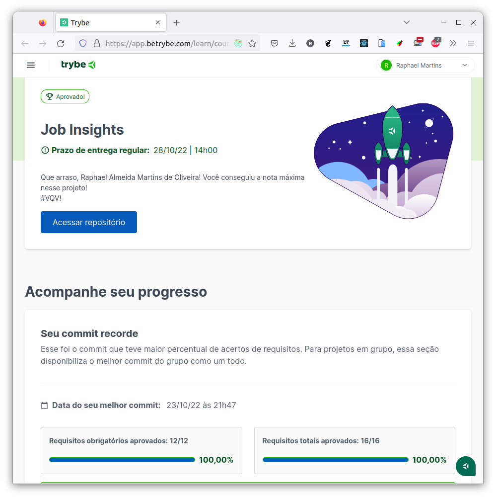

# :snake: Python Job Insights :necktie: :chart_with_upwards_trend:

## :page_with_curl: About/Sobre

  
<strong>:us: English</strong>
 

Python data science project developed by [Raphael Martins](https://www.linkedin.com/in/raphaelameidamartins/) at the end of Unit 33 ([Computer Science Module](https://github.com/raphaelalmeidamartins/trybe_exercicios/tree/main/4_Ciencia-da-Computa%C3%A7%C3%A3o)) of Trybe's Web Development course. I was approved with 100% of the mandatory and optional requirements met.

We had to implement functions for analyzing job insights data in .CSV reports and test them with the Pytest library. We also had to integrate them into a web application previously developed with the Flask framework.
 

  
<strong>:brazil: Português</strong>
 

Projeto de Python e ciência de dados desenvolvido por [Raphael Martins](https://www.linkedin.com/in/raphaelameidamartins/) ao final do Bloco 33 ([Módulo Ciência da Computação](https://github.com/raphaelalmeidamartins/trybe_exercicios/tree/main/4_Ciencia-da-Computa%C3%A7%C3%A3o)) do curso de Desenvolvimento Web da Trybe. Fui aprovado com 100% dos requisitos obrigatórios e opcionais atingidos.

Tivemos que implementar funções para análise de dados de sobre empregos em relatórios .CSV e aplicar testes com a biblioteca Pytest. Também tivemos que integrá-las a uma aplicação Web previamente desenvolvida com o framework Flask.
 

## :man_technologist: Developed Skills/Habilidades Desenvolvidas

  
<strong>:us: English</strong>
 

* Use Python's interactive terminal.
* Use conditional and repeating structures.
* Use the Python built-in functions.
* Handle exceptions.
* Perform file manipulation.
* Write functions.
* Write tests with Pytest.
* Write your own modules and import them into other code.
 

  
<strong>:brazil: Português</strong>
 

* Utilizar o terminal interativo do Python.
* Utilizar estruturas condicionais e de repetição.
* Utilizar funções built-in do Python.
* Utilizar tratamento de exceções.
* Realizar a manipulação de arquivos.
* Escrever funções.
* Escrever testes com Pytest.
* Escrever seus próprios módulos e importá-los em outros códigos.

 

## :hammer_and_wrench: Tools/Ferramentas

* Python
* Pytest

## :trophy: Grade/Nota

